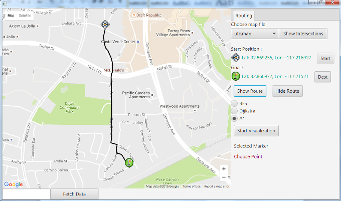
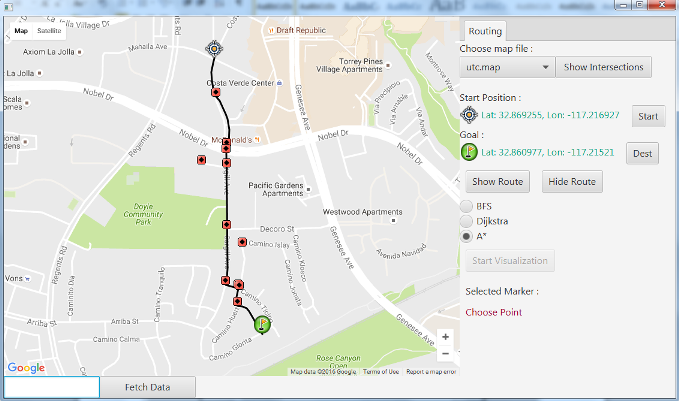

# UCSDGraphs
Java project for Advanced Data Structure course by University of California, San Diego

## Working with the code
To run the application, build the **MapApp.java** file form **/src/Application** folder.

## Features
* Fetch and save intersection data for any location on the map.
* Load the fetched intersection file and visulaise the intersections present.
* Select two intersetcion points and find path between them using **BFS/Dijkstra/A*** algorithm.
* Visualize how the algortihm found the path.

## Screens
* Main window showing intersections of the path on the map

* Path found after clicking **Show Route** button with one of the searching algorithms selected.

* Showing intersection points visited during the search with A* algorithm

